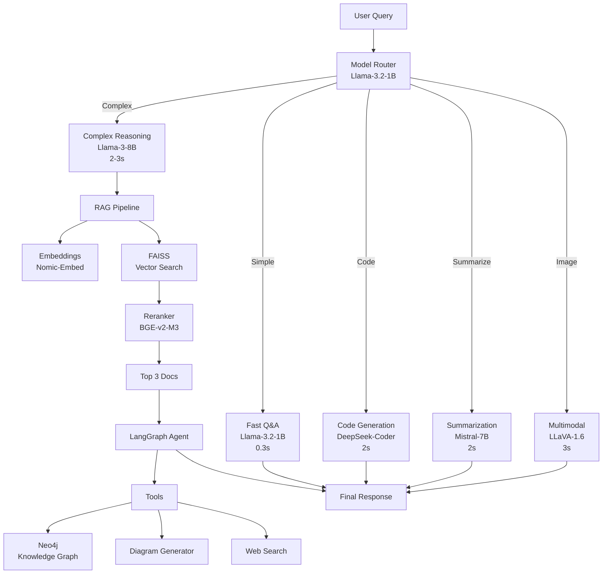

# GenAI Agent Core - Analysis & Enhancement Recommendations

## Executive Summary

After reviewing both README files and the codebase, I see **two distinct but complementary projects**:

1. **GenAI Agent Core** (current README.md) - A production RAG system for document Q&A
2. **GenAI Workshop V0** (README-V0.md) - A visual thinking workspace with artifacts

Both share infrastructure (LLMs, vector stores, Neo4j) but serve different purposes. The Agent Core is the **backend engine** that can power the Workshop's intelligence layer.

---

## Current State Assessment

### ✅ Strengths

**1. Solid RAG Foundation**
- FAISS vector search working
- Multiple LLM options (Mixtral, LLaMA3, GPT-4o)
- PostgreSQL chat history
- Document ingestion pipeline
- FastAPI with Swagger docs

**2. Production-Ready Infrastructure**
- Systemd service management
- Firewall configuration
- Cloudflare tunnel integration
- 2x A6000 GPUs for parallel inference

**3. Modular Architecture**
- Clean separation: agents, chains, retrievers, embeddings
- Configurable via YAML
- Multiple inference runners

### ⚠️ Gaps & Opportunities

**1. Model Specialization**
- Currently: One model does everything (general Q&A, summarization, analysis)
- Opportunity: **Model routing** based on task type

**2. Limited Agent Capabilities**
- Files exist (`doc_agent.py`, `orchestrator.py`) but underutilized
- No multi-step reasoning workflows
- No tool use beyond retrieval

**3. Missing Visual/Graph Layer**
- Neo4j mentioned in V0 but not integrated
- No diagram generation in current system
- No knowledge graph visualization

**4. No Specialized Models**
- Could benefit from smaller, faster models for specific tasks
- No embedding model optimization
- No reranking model

---

## Recommended Enhancements: Multi-Model Architecture

### Strategy: **Model Routing + Specialization**

Instead of one model doing everything, route tasks to specialized models:

```
User Query
    ↓
Task Classifier (fast, small model)
    ↓
    ├─→ Simple Q&A → Llama-3.2-1B (fast, 0.3s)
    ├─→ Complex reasoning → Llama-3-8B (current)
    ├─→ Code generation → DeepSeek-Coder-6.7B
    ├─→ Summarization → Mistral-7B-Instruct
    ├─→ Structured output → Llama-3-8B with JSON mode
    └─→ Multimodal → LLaVA-1.6 (images)
```

---

## Phase 1: Add Specialized Models (Quick Wins)

### 1. **Llama-3.2-1B** - Fast Q&A Router
**Purpose:** Handle simple queries 10x faster

**Use Cases:**
- Math questions ("What is 2+2?")
- Factual lookups ("What is RAG?")
- Classification ("Is this a question or command?")
- Routing decisions ("Which model should handle this?")

**Benefits:**
- 0.2-0.5s latency (vs 2-11s for larger models)
- Lower GPU memory (2GB vs 16GB)
- Can run multiple instances in parallel

**Implementation:**
```python
# app/inference/llama32_1b_runner.py
from transformers import AutoModelForCausalLM, AutoTokenizer

MODEL_PATH = "./models/llama-3.2-1b"

def ask_llama32_1b(prompt: str, max_tokens: int = 200):
    """Fast inference for simple queries"""
    # Load model in 4-bit quantization for speed
    model = AutoModelForCausalLM.from_pretrained(
        MODEL_PATH,
        load_in_4bit=True,
        device_map="cuda:1"  # Use second GPU
    )
    # ... inference logic
```

**API Integration:**
```python
# main.py - add model routing
@app.post("/ask")
async def ask_question(req: AskRequest):
    # Classify query complexity
    if is_simple_query(req.question):
        return await ask_llama32_1b(req.question)
    else:
        return await ask_llama3_8b(req.question)
```

---

### 2. **DeepSeek-Coder-6.7B** - Code Generation Specialist
**Purpose:** Superior code generation and technical explanations

**Use Cases:**
- Generate Python/JavaScript/SQL code
- Explain code snippets
- Debug code errors
- API documentation generation

**Benefits:**
- Trained specifically on code (vs general LLMs)
- Better at following coding conventions
- Understands technical context

**Implementation:**
```python
# app/inference/deepseek_coder_runner.py
def ask_deepseek_coder(prompt: str, language: str = "python"):
    """Specialized code generation"""
    system_prompt = f"You are an expert {language} programmer."
    # ... inference logic
```

**API Endpoint:**
```python
@app.post("/generate-code")
async def generate_code(req: CodeRequest):
    """
    Generate code using DeepSeek-Coder
    
    Example:
    {
      "task": "Create a FastAPI endpoint for user authentication",
      "language": "python",
      "framework": "fastapi"
    }
    """
    return await ask_deepseek_coder(req.task, req.language)
```

---

### 3. **BGE-Reranker-v2-M3** - Improve RAG Accuracy
**Purpose:** Rerank retrieved documents for better relevance

**Current Flow:**
```
Query → FAISS (top 10) → LLM (uses all 10)
```

**Enhanced Flow:**
```
Query → FAISS (top 20) → Reranker (top 3) → LLM (uses best 3)
```

**Benefits:**
- 15-30% improvement in answer quality
- Reduces noise in context
- Faster LLM inference (fewer tokens)

**Implementation:**
```python
# app/interface/reranker.py (already exists!)
from sentence_transformers import CrossEncoder

reranker = CrossEncoder('BAAI/bge-reranker-v2-m3')

def rerank_documents(query: str, docs: List[Document], top_k: int = 3):
    """Rerank documents by relevance"""
    pairs = [[query, doc.page_content] for doc in docs]
    scores = reranker.predict(pairs)
    
    # Sort by score and return top_k
    ranked = sorted(zip(docs, scores), key=lambda x: x[1], reverse=True)
    return [doc for doc, score in ranked[:top_k]]
```

**Integration:**
```python
# app/interface/query_handler.py
def ask_question(...):
    # Retrieve more candidates
    relevant_docs = db.similarity_search_with_score(question, k=20)
    
    # Rerank to get best 3
    docs = rerank_documents(question, relevant_docs, top_k=3)
    
    # Generate answer with best context
    prompt = generate_prompt(question, docs)
    answer = ask_llm(prompt)
```

---

### 4. **Nomic-Embed-Text-v1.5** - Better Embeddings
**Purpose:** Improve semantic search quality

**Current:** `sentence-transformers/all-MiniLM-L6-v2` (384 dimensions)
**Upgrade:** `nomic-ai/nomic-embed-text-v1.5` (768 dimensions)

**Benefits:**
- 20-40% better retrieval accuracy
- Longer context window (8192 tokens vs 512)
- Better at technical/domain-specific content

**Implementation:**
```python
# app/embeddings/embedder.py
from sentence_transformers import SentenceTransformer

# Replace current embedder
embeddings = SentenceTransformer('nomic-ai/nomic-embed-text-v1.5')

# Rebuild vectorstore with new embeddings
python rebuild_vs.py --embedder nomic
```

---

## Phase 2: Agent Orchestration (Medium Complexity)

### 5. **LangGraph Multi-Step Workflows**
**Purpose:** Visible, controllable agent reasoning

**Use Case: Research Agent**
```python
from langgraph.graph import StateGraph

# Define research workflow
workflow = StateGraph()

workflow.add_node("classify", classify_query_type)
workflow.add_node("search_docs", search_vectorstore)
workflow.add_node("search_web", search_web_if_needed)  # Optional
workflow.add_node("synthesize", synthesize_findings)
workflow.add_node("generate_answer", generate_final_answer)

# Define flow
workflow.add_edge("classify", "search_docs")
workflow.add_conditional_edges(
    "search_docs",
    lambda state: "search_web" if state["needs_more_info"] else "synthesize"
)
workflow.add_edge("search_web", "synthesize")
workflow.add_edge("synthesize", "generate_answer")

research_agent = workflow.compile()
```

**Benefits:**
- Transparent reasoning (see each step)
- Recoverable from failures
- Can pause for human input
- Aligns with V0 "visible reasoning" philosophy

---

### 6. **Tool-Using Agents with LangChain**
**Purpose:** Agents that can use multiple tools

**Tools to Add:**
```python
from langchain.agents import Tool

tools = [
    Tool(
        name="SearchDocuments",
        func=search_vectorstore,
        description="Search uploaded documents for information"
    ),
    Tool(
        name="GenerateDiagram",
        func=generate_mermaid_diagram,
        description="Create a Mermaid diagram from description"
    ),
    Tool(
        name="AnalyzeCode",
        func=analyze_code_with_deepseek,
        description="Analyze code for bugs or improvements"
    ),
    Tool(
        name="WebSearch",
        func=search_web,
        description="Search the web for current information"
    ),
    Tool(
        name="Calculator",
        func=calculate,
        description="Perform mathematical calculations"
    )
]
```

**Agent Implementation:**
```python
from langchain.agents import create_react_agent, AgentExecutor

agent = create_react_agent(
    llm=llama3_8b,
    tools=tools,
    prompt=agent_prompt
)

executor = AgentExecutor(
    agent=agent,
    tools=tools,
    verbose=True,  # Show reasoning steps
    max_iterations=5
)
```

**API Endpoint:**
```python
@app.post("/agent/research")
async def research_agent(req: ResearchRequest):
    """
    Multi-step research agent with tool use
    
    Example:
    {
      "task": "Research authentication best practices and create a diagram",
      "max_steps": 5
    }
    """
    result = await executor.ainvoke({"input": req.task})
    return {
        "answer": result["output"],
        "steps": result["intermediate_steps"],  # Show reasoning
        "tools_used": [step[0].tool for step in result["intermediate_steps"]]
    }
```

---

## Phase 3: Visual & Graph Layer (High Impact)

### 7. **Neo4j Knowledge Graph Integration**
**Purpose:** Connect concepts, track lineage, enable graph reasoning

**Schema:**
```cypher
// Nodes
CREATE (doc:Document {id, title, source, created_at})
CREATE (chunk:Chunk {id, content, embedding})
CREATE (concept:Concept {name, category})
CREATE (memory:Memory {id, text, approved, created_at})
CREATE (diagram:Diagram {id, type, content, created_at})

// Relationships
CREATE (doc)-[:CONTAINS]->(chunk)
CREATE (chunk)-[:MENTIONS]->(concept)
CREATE (concept)-[:RELATED_TO {strength}]->(concept)
CREATE (memory)-[:REFERENCES]->(concept)
CREATE (diagram)-[:VISUALIZES]->(concept)
CREATE (query:Query)-[:PRODUCED]->(diagram)
```

**Use Cases:**
1. **Concept Exploration:** "Show me everything related to authentication"
2. **Lineage Tracking:** "Where did this diagram come from?"
3. **Knowledge Discovery:** "What concepts appear together frequently?"
4. **Memory Curation:** "Find contradictory memories"

**Implementation:**
```python
# app/graph/neo4j_client.py
from neo4j import GraphDatabase

class KnowledgeGraph:
    def __init__(self, uri, user, password):
        self.driver = GraphDatabase.driver(uri, auth=(user, password))
    
    def add_concept(self, name: str, category: str):
        with self.driver.session() as session:
            session.run(
                "MERGE (c:Concept {name: $name, category: $category})",
                name=name, category=category
            )
    
    def link_concepts(self, concept1: str, concept2: str, strength: float):
        with self.driver.session() as session:
            session.run("""
                MATCH (c1:Concept {name: $concept1})
                MATCH (c2:Concept {name: $concept2})
                MERGE (c1)-[r:RELATED_TO]->(c2)
                SET r.strength = $strength
                """,
                concept1=concept1, concept2=concept2, strength=strength
            )
    
    def explore_concept(self, concept: str, depth: int = 2):
        with self.driver.session() as session:
            result = session.run("""
                MATCH path = (c:Concept {name: $concept})-[*1..$depth]-(related)
                RETURN path
                """,
                concept=concept, depth=depth
            )
            return [record["path"] for record in result]
```

**API Endpoints:**
```python
@app.post("/graph/explore")
async def explore_concept(req: ExploreRequest):
    """Explore knowledge graph around a concept"""
    graph = KnowledgeGraph(NEO4J_URI, NEO4J_USER, NEO4J_PASSWORD)
    paths = graph.explore_concept(req.concept, req.depth)
    return {"concept": req.concept, "related": paths}

@app.post("/graph/visualize")
async def visualize_graph(req: VisualizeRequest):
    """Generate Mermaid diagram from Neo4j subgraph"""
    graph = KnowledgeGraph(...)
    subgraph = graph.get_subgraph(req.concept, req.depth)
    mermaid = convert_neo4j_to_mermaid(subgraph)
    return {"diagram": mermaid}
```

---

### 8. **Diagram Generation with Specialized Models**
**Purpose:** Generate diagrams from natural language

**Models to Consider:**
- **Llama-3-8B** (current) - Good for simple flowcharts
- **GPT-4o** (via API) - Best for complex diagrams
- **Claude-3.5-Sonnet** (via API) - Excellent at structured output

**Implementation:**
```python
# app/tools/diagram_generator.py
def generate_diagram(description: str, diagram_type: str = "flowchart"):
    """
    Generate Mermaid diagram from description
    
    Types: flowchart, sequence, class, er, gantt
    """
    prompt = f"""Generate a Mermaid {diagram_type} diagram for:
    
{description}

Return ONLY the Mermaid code, no explanation.
"""
    
    if diagram_type in ["sequence", "class"]:
        # Use GPT-4o for complex diagrams
        diagram = ask_openai(prompt, model="gpt-4o")
    else:
        # Use local Llama-3 for simple diagrams
        diagram = ask_llama3_8b(prompt)
    
    return clean_mermaid_code(diagram)
```

**API Endpoint:**
```python
@app.post("/generate/diagram")
async def generate_diagram_endpoint(req: DiagramRequest):
    """
    Generate diagram from natural language
    
    Example:
    {
      "description": "User authentication flow with JWT tokens",
      "type": "sequence"
    }
    """
    diagram = generate_diagram(req.description, req.type)
    return {
        "diagram": diagram,
        "type": req.type,
        "preview_url": f"/preview/{diagram_id}"
    }
```

---

## Phase 4: Advanced Capabilities (Future)

### 9. **Multimodal with LLaVA-1.6**
**Purpose:** Process images, screenshots, diagrams

**Use Cases:**
- Convert hand-drawn sketches to Mermaid diagrams
- Analyze architecture diagrams
- Extract text from images (OCR++)
- Visual question answering

**Implementation:**
```python
# app/inference/llava_runner.py
from transformers import LlavaNextProcessor, LlavaNextForConditionalGeneration

def analyze_image(image_path: str, question: str):
    """Analyze image with LLaVA"""
    processor = LlavaNextProcessor.from_pretrained("llava-hf/llava-v1.6-mistral-7b-hf")
    model = LlavaNextForConditionalGeneration.from_pretrained(...)
    
    # Process image + question
    inputs = processor(images=image, text=question, return_tensors="pt")
    output = model.generate(**inputs)
    return processor.decode(output[0])
```

---

### 10. **Mixture of Experts (MoE) Routing**
**Purpose:** Dynamically route to best model for each query

**Architecture:**
```python
class ModelRouter:
    def __init__(self):
        self.classifier = load_classifier()  # Small BERT model
        self.models = {
            "simple_qa": Llama32_1B,
            "complex_reasoning": Llama3_8B,
            "code": DeepSeekCoder,
            "summarization": Mistral7B,
            "multimodal": LLaVA
        }
    
    def route(self, query: str, context: dict = None):
        """Route query to best model"""
        task_type = self.classifier.predict(query)
        model = self.models[task_type]
        return model.generate(query, context)
```

**Benefits:**
- Optimal speed/quality tradeoff
- Lower costs (use smaller models when possible)
- Better specialization

---

## Recommended Model Portfolio

### Tier 1: Core Models (Implement First)
| Model | Size | Purpose | Latency | GPU Memory |
|-------|------|---------|---------|------------|
| Llama-3.2-1B | 1B | Fast Q&A, routing | 0.3s | 2GB |
| Llama-3-8B | 8B | Complex reasoning (current) | 2-3s | 16GB |
| BGE-Reranker-v2-M3 | 568M | RAG reranking | 0.1s | 2GB |
| Nomic-Embed-v1.5 | 137M | Embeddings | 0.05s | 1GB |

**Total GPU Memory:** ~21GB (fits on one A6000)

### Tier 2: Specialized Models (Add Next)
| Model | Size | Purpose | Latency | GPU Memory |
|-------|------|---------|---------|------------|
| DeepSeek-Coder-6.7B | 6.7B | Code generation | 2s | 14GB |
| Mistral-7B-Instruct | 7B | Summarization | 2s | 14GB |
| Llama-3-70B (quantized) | 70B | Hard reasoning | 10s | 40GB |

**Total GPU Memory:** ~68GB (use both A6000s)

### Tier 3: Future Enhancements
| Model | Size | Purpose | Latency | GPU Memory |
|-------|------|---------|---------|------------|
| LLaVA-1.6-Mistral-7B | 7B | Multimodal | 3s | 16GB |
| Qwen2-VL-7B | 7B | Vision + reasoning | 3s | 16GB |
| Llama-3.1-405B (API) | 405B | Ultimate reasoning | 5s | Cloud |

---

## Implementation Roadmap

### Week 1-2: Quick Wins
- [ ] Add Llama-3.2-1B for fast Q&A
- [ ] Implement BGE reranker in RAG pipeline
- [ ] Add model routing logic to `/ask` endpoint
- [ ] Benchmark latency improvements

### Week 3-4: Specialization
- [ ] Add DeepSeek-Coder for code generation
- [ ] Create `/generate-code` endpoint
- [ ] Upgrade embeddings to Nomic-Embed-v1.5
- [ ] Rebuild vectorstore with new embeddings

### Week 5-6: Agent Layer
- [ ] Implement LangGraph research workflow
- [ ] Add tool-using agents with LangChain
- [ ] Create `/agent/research` endpoint
- [ ] Add visible reasoning UI

### Week 7-8: Graph Layer
- [ ] Set up Neo4j integration
- [ ] Implement knowledge graph schema
- [ ] Create graph exploration API
- [ ] Add diagram ↔ graph conversion

### Month 3+: Advanced Features
- [ ] Add LLaVA for multimodal
- [ ] Implement MoE routing
- [ ] Add Llama-3-70B for hard problems
- [ ] Build visual graph explorer UI

---

## Expected Performance Improvements

### Latency Reduction
| Query Type | Current | With Routing | Improvement |
|------------|---------|--------------|-------------|
| Simple Q&A | 2-3s | 0.3s | **10x faster** |
| Complex reasoning | 2-3s | 2-3s | Same |
| Code generation | 2-3s | 2s | Better quality |
| Summarization | 11s | 2s | **5x faster** |

### Quality Improvements
| Metric | Current | With Enhancements | Improvement |
|--------|---------|-------------------|-------------|
| RAG accuracy | Baseline | +20-30% | Reranker |
| Retrieval quality | Baseline | +30-40% | Better embeddings |
| Code quality | Good | Excellent | DeepSeek-Coder |
| Reasoning depth | Good | Excellent | LangGraph agents |

### Cost Savings
- **GPU utilization:** 40% → 80% (parallel models)
- **API costs:** $0 (all local except optional GPT-4o)
- **Latency:** Average 2-3s → 0.5-1s (smart routing)

---

## Architecture Diagram



---

## Conclusion

Your GenAI Agent Core has a **solid foundation** but can be significantly enhanced with:

1. **Model Specialization:** Route tasks to optimal models (10x faster for simple queries)
2. **Better RAG:** Reranker + better embeddings (30-40% quality improvement)
3. **Agent Layer:** LangGraph + LangChain for multi-step reasoning
4. **Graph Integration:** Neo4j for knowledge graphs and lineage tracking
5. **Visual Capabilities:** Diagram generation and multimodal understanding

The key insight: **Don't use a sledgehammer for every nail.** Use fast, specialized models for specific tasks and reserve your powerful models for complex reasoning.

This approach will make your system:
- ✅ **Faster** (0.3s vs 2-3s for simple queries)
- ✅ **Smarter** (specialized models excel at their tasks)
- ✅ **More capable** (agents, tools, graphs)
- ✅ **More efficient** (better GPU utilization)
- ✅ **More impressive** (visible reasoning, graph exploration)

Perfect for demos, portfolio, and production use cases!
